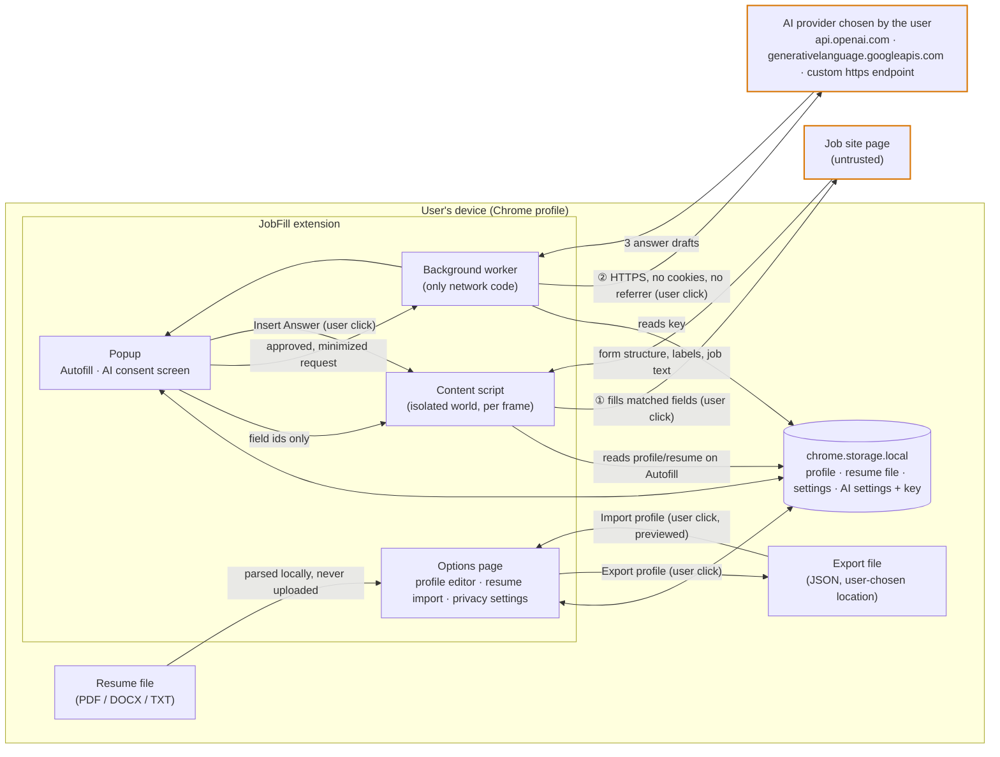
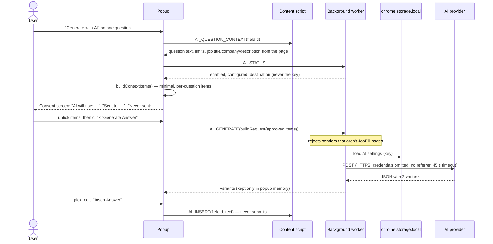

# JobFill privacy architecture

**Principle:** JobFill is local-first. Candidate data does not leave the user's device unless the
user explicitly activates a feature that requires external processing.

This document describes how the extension is built to meet that principle, where data can flow,
the results of the privacy and security audit, and the risks that remain. The user-facing
summary is in [PRIVACY.md](../PRIVACY.md); the in-product version is the **Privacy settings**
page (`#/privacy` on the options page).

Claims here are pinned by tests where possible, especially
[apps/extension/src/privacy-guards.test.ts](../apps/extension/src/privacy-guards.test.ts). If a
statement stops being true, a test should fail.

---

## 1. Components and trust boundaries

| Component                  | Runs in                                                 | Trust                                | Can read                                                                                         |
| -------------------------- | ------------------------------------------------------- | ------------------------------------ | ------------------------------------------------------------------------------------------------ |
| **Options page**           | `chrome-extension://` page                              | Trusted (extension origin)           | Everything in `chrome.storage.local`, incl. AI settings                                          |
| **Popup**                  | `chrome-extension://` page                              | Trusted                              | Profile and settings; asks the background for AI status (never receives the key)                 |
| **Background worker**      | Extension service worker                                | Trusted                              | AI settings and key (the only code that uses the key); the only code that makes network requests |
| **Content script**         | Isolated world in every `http(s)` frame                 | Semi-trusted (shares a web renderer) | Profile and resume **only when autofilling**; the debug-mode flag. Never AI settings             |
| **Web page**               | Page's main world                                       | **Untrusted**                        | Whatever is in its own DOM, including fields JobFill filled                                      |
| **AI provider**            | Third party (OpenAI, Google, or a user-chosen endpoint) | Third party, user-chosen             | Only an approved, minimized request                                                              |
| **`chrome.storage.local`** | Chrome profile on disk                                  | On device                            | —                                                                                                |

There is no JobFill server, account, analytics or telemetry endpoint.

## 2. Data-flow diagram

Data leaves JobFill's control only on the two amber edges, each after a user click:

1. **Autofill → the job site.** Filled values are in the page's DOM, so the site's scripts can read
   them straight away (not only on submit). Preview mode lets the user approve each field. JobFill
   never submits.
2. **AI answers → the chosen provider.** Only when AI is enabled, configured with the user's own
   key, and the user clicks **Generate Answer** after seeing exactly what will be sent.

**Export** writes a file the user saves; where it goes afterwards is the user's choice.

### AI request sequence

## 3. Data inventory

Everything JobFill persists is in `chrome.storage.local`, written only through
[apps/extension/src/storage/](../apps/extension/src/storage/). It is not synced (no
`chrome.storage.sync`), and nothing uses `localStorage`, `sessionStorage` or IndexedDB (enforced
by test).

| Key                   | Contents                                                                                                         | Written by                                   | Read by                                                                    | Removed by                                         |
| --------------------- | ---------------------------------------------------------------------------------------------------------------- | -------------------------------------------- | -------------------------------------------------------------------------- | -------------------------------------------------- |
| `jobfill.profile.v2`  | Profile: personal, professional, education, experience, projects, certifications, skills, links, resume metadata | Options page (editor, import, resume review) | Options, popup, content script (Autofill only)                             | Reset profile · Delete all local data              |
| `jobfill.resume.v1`   | Resume file (base64, ≤ 5 MB), only if the user keeps it                                                          | Options page                                 | Options (export, re-import), content script (attaching to an upload field) | Remove resume · Reset · Delete all local data      |
| `jobfill.settings.v1` | `previewBeforeFill`, `debugMode`                                                                                 | Popup, options                               | Popup, options, content script (debug flag)                                | Delete all local data                              |
| `jobfill.ai.v1`       | AI on/off, provider, model, endpoint, **user's API key**                                                         | Options page                                 | Options page, background worker — **never** content scripts (test)         | Turn off AI and forget key · Delete all local data |
| `jobfill.profile.v1`  | Legacy profile, migrated once then deleted                                                                       | —                                            | Migration only                                                             | Migration · Reset · Delete all                     |

**Not stored anywhere:** AI prompts or generated answers (popup memory only, discarded on close),
history of sites or applications, page contents, job descriptions, form values read from pages.
So there is **no AI history** to clear, and the Privacy settings page says so.

## 4. What may leave the device

| Feature          | What                                                                                                                                                                                                                                           | Why                                         | Who receives it                                                                                                                                  | When                                                              |
| ---------------- | ---------------------------------------------------------------------------------------------------------------------------------------------------------------------------------------------------------------------------------------------- | ------------------------------------------- | ------------------------------------------------------------------------------------------------------------------------------------------------ | ----------------------------------------------------------------- |
| Autofill         | Profile values matching fields on the current form; the resume file if the form has a resume upload                                                                                                                                            | Fill the application the user asked to fill | The website being filled                                                                                                                         | "Autofill Application" click (per-field approval in preview mode) |
| AI answers (opt) | Question; job title, company, description (≤ 3,000 chars) from the page; the ticked profile items: current role, ≤ 12 relevant skills, ≤ 2 roles with 300-char highlights, education, summary (not pre-ticked); the API key for authentication | Draft an answer to that one question        | The provider the user configured, directly: OpenAI, Google Gemini, or a custom OpenAI-compatible endpoint (HTTPS; plain HTTP only for localhost) | "Generate Answer" click, after the consent screen                 |
| Export           | Profile (and resume if chosen) as JSON                                                                                                                                                                                                         | Backup / move to another browser            | A file on the user's computer                                                                                                                    | "Export profile" click                                            |

**Never in an AI request**, whatever is ticked: name, email, phone, address, links, salary,
work authorization or sponsorship, demographic answers, resume file. This is enforced in
[packages/ai/src/context.ts](../packages/ai/src/context.ts) (`NEVER_SENT_TO_AI`) and tested. The
provider also sees the user's IP address, as with any web request, and applies its own retention
policy.

## 5. Audit results

Audit scope: `apps/extension/src`, `packages/*/src`, the manifest and the release build output.

| #   | Area                 | Finding                                                                                                                                                                                                                                                                                                                                                     | Action                                                                                                                                                                                                                    |
| --- | -------------------- | ----------------------------------------------------------------------------------------------------------------------------------------------------------------------------------------------------------------------------------------------------------------------------------------------------------------------------------------------------------- | ------------------------------------------------------------------------------------------------------------------------------------------------------------------------------------------------------------------------- |
| 1   | chrome.storage usage | Only `chrome.storage.local`; 4 keys through one module. The content script reads the settings key directly (debug flag) and profile/resume via the storage module when autofilling.                                                                                                                                                                         | Invariants pinned by test (no sync, no web storage, AI key never read by content scripts). Wrong comment on `STORAGE_KEYS.ai` fixed.                                                                                      |
| 2   | Content scripts      | Run on all `http(s)` frames. Passive: read DOM structure only; no page-facing API (no `postMessage`/`window` listeners); receive messages only from the extension. Debug overlay lives in a closed shadow root. Values are only written on user action.                                                                                                     | No change needed. Scope documented and justified (§6).                                                                                                                                                                    |
| 3   | Background worker    | Only `onInstalled` + AI relay. AI messages rejected unless the sender is a JobFill page. Errors mapped to fixed messages.                                                                                                                                                                                                                                   | No change needed.                                                                                                                                                                                                         |
| 4   | Permissions          | `storage` only. No `tabs`, `scripting`, `activeTab`, `cookies`, `history`, `downloads`, `identity`, `unlimitedStorage`.                                                                                                                                                                                                                                     | Nothing to remove; pinned by test. `activeTab` was evaluated as a replacement for the broad content script and rejected (§6).                                                                                             |
| 5   | Host permissions     | None. AI providers are reached with CORS requests they allow from browsers.                                                                                                                                                                                                                                                                                 | Pinned by test.                                                                                                                                                                                                           |
| 6   | External requests    | One network function (`postJson` in `packages/ai/src/providers/http.ts`), called only from the background worker. `credentials: 'omit'`, `referrerPolicy: 'no-referrer'`. No fonts, CDNs or remote code. **Issue:** a custom endpoint accepted any URL, including plain `http://` to remote hosts, which would send the key and candidate data unencrypted. | **Fixed:** `checkEndpoint()` requires HTTPS (HTTP only for `localhost`/`127.x`/`[::1]`) and refuses credentials in the URL; tested. Single-network-call-site invariant pinned by test.                                    |
| 7   | API keys             | None shipped. The user's key is stored in `chrome.storage.local`, used only by the background worker, never returned to the popup, masked in the UI, and removable.                                                                                                                                                                                         | Residual risk documented (§7).                                                                                                                                                                                            |
| 8   | Logging              | **Issue:** `logger.error(msg, err)` printed raw error objects. Error messages can echo the data that caused them (validation errors quote rejected values; DOM errors can quote content).                                                                                                                                                                   | **Fixed:** the logger takes fixed messages only and reduces errors to their `name`; `info` is dev-only. ESLint `no-console` now bans direct console use outside the logger and the opt-in field debugger. Tests pin both. |
| 9   | Error reporting      | None: no crash reporting service. User-facing errors are fixed strings; AI errors never include response bodies.                                                                                                                                                                                                                                            | No change needed.                                                                                                                                                                                                         |
| 10  | Analytics            | None: no analytics, telemetry, tracking pixels or beacons (verified by source scan).                                                                                                                                                                                                                                                                        | Invariant pinned by test.                                                                                                                                                                                                 |
| 11  | Resume storage       | Parsed locally with a JS parser using the platform's `DecompressionStream`; no upload, no third-party parser, no `eval`. Stored only if the user opts in; 5 MB input cap. **Issue:** decompressed stream size was unbounded (a small crafted file could exhaust memory).                                                                                    | **Fixed:** each decompressed stream is capped at 32 MB with a clear error; tested.                                                                                                                                        |
| 12  | AI requests          | Off by default; per-question consent listing exactly what is sent and to whom; minimization enforced in code; no AI history stored.                                                                                                                                                                                                                         | "Never sent" list centralized (`NEVER_SENT_TO_AI`) and shown on the privacy page.                                                                                                                                         |
| —   | Privacy claims       | **Issue:** UI copy overclaimed. The banner said "nothing you enter here is uploaded anywhere", the store description said "100% local", and a manifest comment said "no network requests carrying profile data". All are false once AI is enabled. PRIVACY.md said sites receive data only on submit.                                                       | **Fixed:** copy now states the AI exception. Store description says "Local-first: your profile stays on your device"; a test rejects "100%" or "never collect" claims there. PRIVACY.md corrected.                        |

### Controls added

The new **Privacy settings** page (options `#/privacy`, linked from the dashboard, the popup
footer and the privacy banner) provides:

- **What stays on your device**: each stored item with its live size, plus what is deliberately
  not kept.
- **What may leave your device**: per feature, _what_, _why_, _who receives it_ and _when_. This is
  generated from the live AI configuration, so it names the actual provider and host
  ([data-flows.ts](../apps/extension/src/options/privacy/data-flows.ts)).
- **Export profile**, **Import profile** (previewed before replacing).
- **AI history**: states that none is kept; **Turn off AI and forget API key** removes the AI
  settings.
- **Delete all local data**: typed confirmation; clears every JobFill key including the API key.
- **Permissions**: what each permission is for.

## 6. Permission rationale

- **`storage`**: required to keep the profile on the device.
- **Content script on `http(s)://*/*`, `all_frames`, `match_about_blank`** (shown to users as
  "Read and change your data on all websites"). Application forms live on thousands of domains and
  are often in cross-origin iframes: Greenhouse or Lever boards embedded in company careers pages,
  and `about:blank` frames built by form widgets.
  - **`activeTab` + `scripting` was evaluated and rejected.** `activeTab` grants access only to the
    tab's top-level origin, so embedded cross-origin application iframes could not be filled.
    It would also still need a click per page for detection.
  - **Possible future option:** optional host permissions, granted per site from the popup, for
    users who prefer that trade-off.
- **No host permissions** for AI providers: requests are CORS requests, sent without cookies.

## 7. Residual risks and recommendations

| Risk                                                                                                                                                                                                                                                        | Severity | Mitigation / recommendation                                                                                                                                                                                                                                        |
| ----------------------------------------------------------------------------------------------------------------------------------------------------------------------------------------------------------------------------------------------------------- | -------- | ------------------------------------------------------------------------------------------------------------------------------------------------------------------------------------------------------------------------------------------------------------------ |
| **Content scripts can read `chrome.storage.local`** (Chrome's default). Web pages can't reach it: the isolated world keeps page scripts out. But a compromised renderer process on a malicious site could, in principle, request the profile or the AI key. | Low      | Recommended follow-up: `chrome.storage.local.setAccessLevel({ accessLevel: 'TRUSTED_CONTEXTS' })` with the popup passing only the planned values to the content script, or an option to keep the API key in `chrome.storage.session` (cleared on browser restart). |
| API key at rest is unencrypted in the Chrome profile (encryption would need a key stored alongside it, so it adds little). Anyone with access to the OS user account can read it.                                                                           | Low      | Tell users to use a key with spending limits; "forget key" control on the privacy page.                                                                                                                                                                            |
| Pages read filled values before submit (some sites autosave drafts or track field input).                                                                                                                                                                   | Inherent | Stated plainly in the UI and PRIVACY.md; preview mode for per-field approval.                                                                                                                                                                                      |
| AI provider retention and training policies are outside JobFill's control.                                                                                                                                                                                  | Medium   | Consent screen names the destination on every request; minimization; off by default.                                                                                                                                                                               |
| Custom endpoint is trusted by the user's choice; the endpoint's operator sees the approved request and key.                                                                                                                                                 | Low      | HTTPS enforced (loopback excepted); destination shown on every consent screen.                                                                                                                                                                                     |
| Extension fingerprinting: the lazily loaded content-script chunks are web-accessible (CRXJS), so a site could detect that JobFill is installed.                                                                                                             | Low      | Evaluate `use_dynamic_url: true` once CRXJS's loader is verified with it.                                                                                                                                                                                          |
| Debug mode prints detected fields' labels, names and nearby page text to the page's DevTools console (never values). It is off by default in release builds.                                                                                                | Low      | Enforced by the `no-console` lint rule with a single, documented exception.                                                                                                                                                                                        |
| Export files are plaintext JSON containing the full profile.                                                                                                                                                                                                | Low      | Users choose where they go; consider an optional password-encrypted export.                                                                                                                                                                                        |
| No explicit extension-page CSP `connect-src`: MV3's default already forbids remote code, but not arbitrary `fetch` destinations. Custom endpoints make a static allow-list impossible.                                                                      | Low      | Network code is confined to one function (test-enforced) behind endpoint validation.                                                                                                                                                                               |

## 8. How the invariants are enforced

- `apps/extension/src/privacy-guards.test.ts`:
  - a single network call site;
  - no `XMLHttpRequest`, WebSocket, beacons or `eval`;
  - storage only in `chrome.storage.local`;
  - AI settings read only by the background and options pages;
  - console use only in the logger and the debugger;
  - `credentials: 'omit'` and `no-referrer` on AI requests;
  - manifest permissions exactly `['storage']`, with no host, optional or externally connectable entries;
  - no "100%" claims in the store description.
- `apps/extension/src/utils/logger.test.ts`: errors are logged by name only.
- `packages/ai/src/ai.test.ts`:
  - never-sent fields are excluded from requests;
  - the summary is not pre-ticked;
  - endpoint validation.
- `apps/extension/src/options/privacy/PrivacyPage.test.tsx`: the page states each flow and names the provider when AI is on. It never renders the key, and the forget-key control clears the AI settings.
- ESLint `no-console` rule in [eslint.config.js](../eslint.config.js).

When adding a feature that sends data anywhere:

1. Add it to `dataFlows()` in `options/privacy/data-flows.ts`.
2. Add it to §2 and §4 here, and to PRIVACY.md.
3. Update the privacy-guard allow-lists deliberately, with a reason in the commit.
